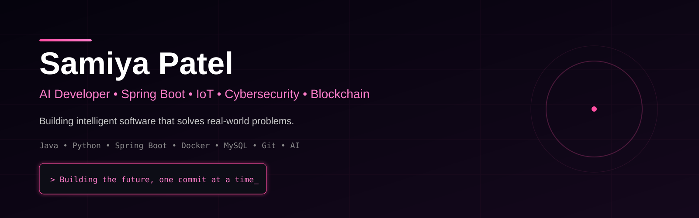
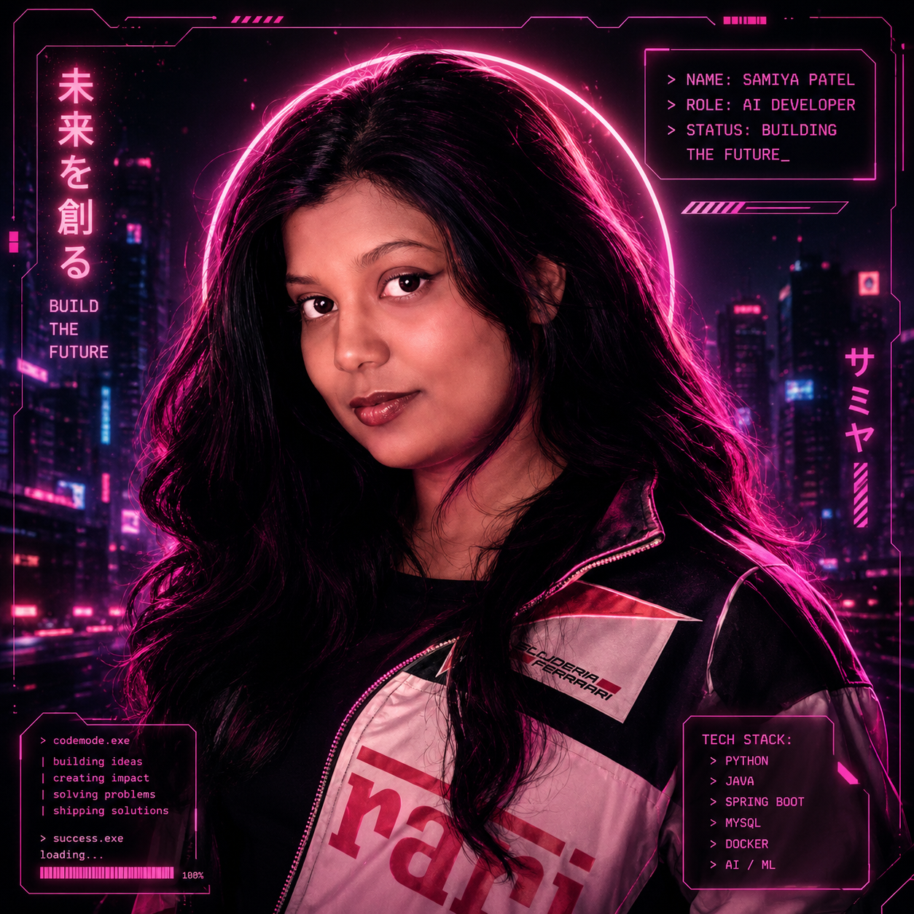

<div align="center">



# 👋 Hey, I'm Samiya Patel




<br><br>

<a href="https://github.com/Sam786-web">

</a>

<a href="https://www.linkedin.com">

</a>

<a href="mailto:samiyap75@gmail.com">

</a>

<br>


</div>

---

# 💻 About Me

```bash
whoami

Name      :: Samiya Patel

College   :: VIIT Pune

Branch    :: CSE (IoT, Cybersecurity & Blockchain)

Role      :: AI Developer

Learning  :: Spring Boot • Docker • AI

Location  :: Pune, India

Status    :: Building awesome things 🚀
```

---
## 👩‍💻 Terminal Portrait

<details>
<summary>🖥️ Click to reveal my ASCII Portrait</summary>

```text
PASTE YOUR ENTIRE ASCII ART HERE
```

</details>